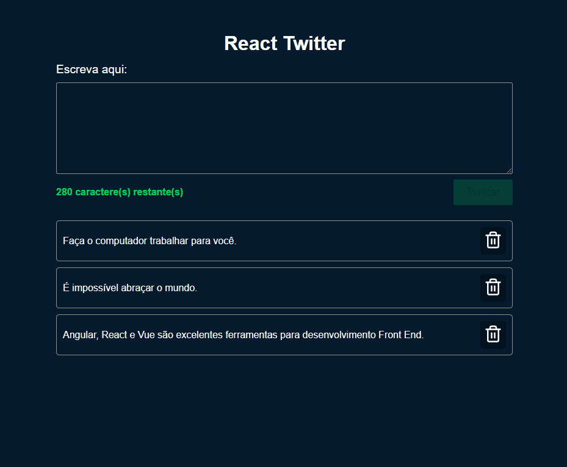

# Atividade React Twitter

### Tecnologias usadas
Typescript, React.js, Axios

### Projeto
O bootcamp não aborda Typescript, então me desafiei a desenvolver esse pequeno projeto usando essa tecnologia.

### Observação antes de rodar o projeto
- Dê um cd na pasta "backend" e dê um yarn start.
- Verifique a baseURL no arquivo api.ts dentro de src > service.
